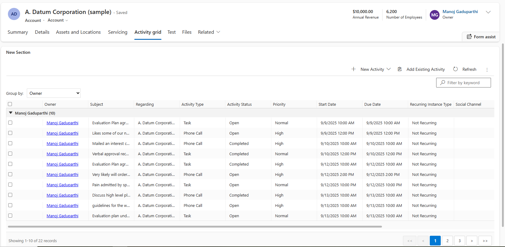

# DynamicGroupGrid PCF Control

Advanced Power Apps Component Framework (PCF) control with dynamic grouping, pagination, and enhanced data grid functionality for Dynamics 365.

## Features

✅ **Grouped Data Display** - Organize records by any column with expand/collapse  
✅ **Multi-Selection** - Ctrl/Shift selection with visual feedback  
✅ **Host Integration** - Syncs selection with native command bar  
✅ **Column Resizing** - Persistent column widths via localStorage  
✅ **Horizontal Scrolling** - View all columns with sticky headers  
✅ **Record Navigation** - Double-click to open records  
✅ **Responsive Design** - Compact collapsed groups, proper styling  
✅ **Pagination** - Configurable page size with navigation controls  



## Quick Start

### Option 1: Use Pre-built Solution Packages (Fastest)

**For immediate deployment, download and import ready-to-use solution packages:**

1. **Download** the latest solution from [Releases](https://github.com/manojgaduparthi/DynamicGroupGrid/tree/main/releases):
   - `DynamicGroupGrid_unmanaged.zip` - For development/testing environments
   - `DynamicGroupGrid_managed.zip` - For production environments

2. **Import** into your Power Platform environment:
   - Open Power Platform admin center → Solutions
   - Click "Import solution" and select the downloaded ZIP file
   - Follow the import wizard

3. **Add to your form** (see [Configuration](#configuration) section below)

### Option 2: Direct PCF Deployment (For Developers)

**Deploy directly to your environment using PAC CLI:**

```bash
# Prerequisites: Install Microsoft PowerPlatform CLI
# https://learn.microsoft.com/en-us/power-platform/developer/cli/introduction

# Navigate to project folder
cd DynamicGroupGrid

# Install dependencies and build
npm install
npm run build

# Authenticate to your environment
pac auth create --url https://yourorg.crm.dynamics.com

# Deploy to your environment  
pac pcf push --publisher-prefix mg
```

### Option 3: Build Your Own Solution Package

**Create customized solution packages for your organization:**

#### Method A: Using This Repository's Solution Source

**Use the included solution structure for consistent packaging:**

```bash
# Clone and prepare
git clone https://github.com/manojgaduparthi/DynamicGroupGrid.git
cd DynamicGroupGrid

# Install dependencies and build the PCF control
npm install
npm run build

# Generate solution packages using included solution structure
pac solution pack --zipfile "releases/DynamicGroupGrid_unmanaged.zip" --folder "solution" --packagetype Unmanaged
pac solution pack --zipfile "releases/DynamicGroupGrid_managed.zip" --folder "solution" --packagetype Managed
```

#### Method B: Create From Scratch in Your Environment

**For organizations requiring specific publisher details:**

```bash
# Prerequisites: Microsoft PowerPlatform CLI installed and authenticated
pac auth create --url https://yourorg.crm.dynamics.com

# Build the control first
npm install
npm run build

# Create a new solution in your environment
pac solution init --publisher-name "YourCompany" --publisher-prefix "yourprefix" --output-directory "MyCustomSolution"

# Deploy the control to your environment
pac pcf push --publisher-prefix yourprefix

# Export solutions from your environment
pac solution export --name "DynamicGroupGrid" --path "DynamicGroupGrid_unmanaged.zip" --managed false
pac solution export --name "DynamicGroupGrid" --path "DynamicGroupGrid_managed.zip" --managed true
```

#### Method C: Automated Batch Generation

**Create a batch script for repeated solution generation:**

Create `generate-solutions.bat`:
```batch
@echo off
echo Building PCF Control...
npm run build

echo Generating Unmanaged Solution...
pac solution pack --zipfile "releases/DynamicGroupGrid_unmanaged.zip" --folder "solution" --packagetype Unmanaged

echo Generating Managed Solution...
pac solution pack --zipfile "releases/DynamicGroupGrid_managed.zip" --folder "solution" --packagetype Managed

echo Solution packages generated in releases/ folder
pause
```

Then run: `generate-solutions.bat`

## Configuration

### Adding to Model-Driven App Forms

1. **Open Form Designer**:
   - Navigate to Power Apps maker portal
   - Open your model-driven app
   - Edit the form where you want to add the control

2. **Add Subgrid Component**:
   - Click "+ Component" in the form designer
   - Select "Subgrid" from the list
   - Configure the data source (select entity and view)

3. **Configure Control**:
   - Go to the **Controls** tab in the subgrid properties
   - Click "Add Control" and search for "DynamicGroupGrid"
   - Set it as default for **Web** experience
   - Configure properties as needed (see [Input Properties](#input-properties) below)

4. **Bind Outputs (Optional)**:
   - Create text fields on the form to capture control outputs
   - Bind `selectedRecordId`, `selectedRecordIds`, and `rowEvent` outputs
   - Use these for custom ribbon commands or business logic

### Input Properties

Configure these properties in the control configuration:

| Property | Type | Default | Description |
|----------|------|---------|-------------|
| `pageSize` | Number | 25 | Records per page (1-100) |
| `enablePagination` | Boolean | true | Show pagination controls |

### Output Properties

Bind these outputs to form fields for advanced integration:

| Output | Type | Description |
|--------|------|-------------|
| `selectedRecordId` | Text | ID of the last selected record |
| `selectedRecordIds` | Text | Comma-separated list of all selected record IDs |
| `rowEvent` | Text | JSON event data containing record details and action type |

### Dataset Configuration

**Important**: Configure these dataset settings for optimal functionality:

- ✅ **Display Command Bar**: `true` (enables ribbon integration)
- ✅ **Display View Selector**: `true` (allows users to switch views)
- ✅ **Display Quick Find**: `true` (enables native search functionality)
- ✅ **Enable Filtering**: `true` (allows column filtering)

## Usage

### Basic Operations
- **Group by**: Use dropdown to select grouping column
- **Select records**: Click checkboxes or rows (Ctrl/Shift for multi-select)
- **Expand/collapse**: Click group headers
- **Resize columns**: Drag column borders
- **Navigate**: Double-click any record to open
- **Pagination**: Use navigation controls at bottom when dataset is large

### Advanced Integration

Use the `rowEvent` and `selectedRecordIds` output properties to integrate with ribbon commands and custom JavaScript web resources. Bind these outputs to hidden text fields on the form, then read them from your ribbon button action functions.

## Development & Customization

### Prerequisites

- **Node.js** (v16+ required, v18+ recommended)
- **Microsoft PowerPlatform CLI** ([Installation Guide](https://learn.microsoft.com/en-us/power-platform/developer/cli/introduction))
- **Power Platform environment** with PCF feature enabled

### Local Development Setup

```bash
# Clone the repository
git clone https://github.com/manojgaduparthi/DynamicGroupGrid.git
cd DynamicGroupGrid

# Install dependencies
npm install

# Start development test harness
npm start
```

### Building for Production

```bash
# Build optimized version
npm run build

# Build output will be in the out/ directory
```

### Solution Package Generation

**Using Repository Solution Structure (Recommended):**

This repository includes a pre-configured solution structure in the `solution/` folder that generates clean, minimal packages.

```bash
# Generate both packages
pac solution pack --zipfile "releases/DynamicGroupGrid_unmanaged.zip" --folder "solution" --packagetype Unmanaged
pac solution pack --zipfile "releases/DynamicGroupGrid_managed.zip" --folder "solution" --packagetype Managed
```

**Benefits of using the included solution structure:**
- ✅ Clean package structure (no extra folders)
- ✅ Minimal file size (~16KB)
- ✅ Generic publisher info (works with any environment)
- ✅ Includes only essential solution components

**Creating Custom Solution Packages:**

For organizations needing specific publisher details:

```bash
# Method 1: Create solution in your environment and export
pac auth create --url https://yourorg.crm.dynamics.com
pac pcf push --publisher-prefix yourprefix
pac solution export --name "YourSolutionName" --path "custom_unmanaged.zip" --managed false
pac solution export --name "YourSolutionName" --path "custom_managed.zip" --managed true

# Method 2: Modify the included solution structure
# Edit solution/Other/Solution.xml to update publisher details
# Then use pac solution pack as shown above
```

### Understanding Solution Structure

This repository includes a complete solution structure in the `solution/` folder:

```
solution/
├── Controls/                                    # PCF control files
│   └── mg_DynamicGroupGrid.PCF.DynamicGroupGrid/
│       ├── bundle.js                           # Compiled control logic
│       ├── ControlManifest.xml                 # Control metadata
│       └── css/                                # Stylesheets
└── Other/                                      # Solution manifests
    ├── Customizations.xml                      # Defines included components
    └── Solution.xml                            # Solution metadata
```

**Key Solution Files:**

- **`Customizations.xml`**: Solution manifest skeleton — pac solution pack auto-discovers controls from the `Controls/` folder
- **`Solution.xml`**: Contains solution metadata like version, publisher, and display name
- **`Controls/`**: Contains the actual compiled PCF control files that get imported

**Benefits of This Approach:**
- ✅ **Environment Independent**: No environment-specific data embedded
- ✅ **Consistent**: Same package works across all environments
- ✅ **Minimal**: Only includes essential components (~16KB total)
- ✅ **Professional**: Clean structure suitable for distribution

### Customizing Solution Metadata

To create packages with your organization's branding:

1. **Edit `solution/Other/Solution.xml`**:
```xml
<ImportExportXml>
  <SolutionManifest>
    <UniqueName>YourOrgDynamicGroupGrid</UniqueName>
    <LocalizedNames>
      <LocalizedName description="Your Org Dynamic Group Grid" languagecode="1033" />
    </LocalizedNames>
    <Publisher>
      <UniqueName>YourOrgPublisher</UniqueName>
      <LocalizedNames>
        <LocalizedName description="Your Organization" languagecode="1033" />
      </LocalizedNames>
    </Publisher>
    <Version>1.0.0.0</Version>
  </SolutionManifest>
</ImportExportXml>
```

2. **Generate packages with your branding**:
```bash
pac solution pack --zipfile "YourOrg_DynamicGroupGrid_v1.0.zip" --folder "solution" --packagetype Managed
```

### Project Structure

```
DynamicGroupGrid/
├── 📁 DynamicGroupGrid/          # PCF Control source code
│   ├── index.ts                  # Main control logic
│   ├── css/DynamicGroupGrid.css  # Component styles
│   ├── ControlManifest.Input.xml # Control definition & metadata
│   └── generated/                # Auto-generated TypeScript types
├── 📁 solution/                  # Solution packaging structure
│   ├── Controls/                 # Compiled control files
│   └── Other/                    # Solution manifests (Solution.xml, Customizations.xml)
├── 📁 releases/                  # Generated solution packages
│   ├── DynamicGroupGrid_v1.0.12_managed.zip    # Ready-to-import managed solution
│   └── DynamicGroupGrid_v1.0.12_unmanaged.zip  # Ready-to-import unmanaged solution
├──  package.json               # NPM dependencies and scripts
├── 📄 DynamicGroupGrid.pcfproj   # PCF project configuration
├── 📄 tsconfig.json              # TypeScript compiler settings
└── 📄 README.md                  # This documentation
```

### Key Development Files

- **`DynamicGroupGrid/index.ts`** - Core control implementation with grouping, selection, and pagination logic
- **`DynamicGroupGrid/css/DynamicGroupGrid.css`** - Complete styling including responsive design and themes
- **`DynamicGroupGrid/ControlManifest.Input.xml`** - Control metadata, dataset bindings, and property definitions
- **`solution/Other/Customizations.xml`** - Solution manifest with CustomControl definitions
- **`solution/Other/Solution.xml`** - Solution metadata and version information

## Installation & Deployment

### Ready-to-Use Solution Packages

**Fastest method - Download and import pre-built solutions:**

1. **Download Latest Release**:
   - Visit [GitHub Releases](https://github.com/manojgaduparthi/DynamicGroupGrid/tree/main/releases)
   - Download `DynamicGroupGrid_managed.zip` (production) or `DynamicGroupGrid_unmanaged.zip` (development)

2. **Import Solution**:
   - Open Power Platform admin center
   - Navigate to Solutions → Import solution
   - Upload the downloaded ZIP file and follow the wizard

3. **Add to Forms** (see [Configuration](#configuration) section)

### PAC CLI Deployment

**For developers with PowerPlatform CLI:**

```bash
# Prerequisites: Install Microsoft PowerPlatform CLI
# https://learn.microsoft.com/en-us/power-platform/developer/cli/introduction

# Clone and build
git clone https://github.com/manojgaduparthi/DynamicGroupGrid.git
cd DynamicGroupGrid
npm install && npm run build

# Deploy to your environment
pac auth create --url https://yourorg.crm.dynamics.com
pac pcf push --publisher-prefix mg
```

### Custom Solution Generation

**Create organization-specific solution packages:**

```bash
# Option 1: Use included solution structure (recommended)
pac solution pack --zipfile "MyOrg_DynamicGroupGrid_unmanaged.zip" --folder "solution" --packagetype Unmanaged
pac solution pack --zipfile "MyOrg_DynamicGroupGrid_managed.zip" --folder "solution" --packagetype Managed

# Option 2: Export from your environment after deployment
pac auth create --url https://yourorg.crm.dynamics.com
pac pcf push --publisher-prefix yourprefix
pac solution export --name "DynamicGroupGrid" --path "custom_package.zip" --managed true
```

## Technical Details

### Architecture
- **Framework**: PowerApps Component Framework (PCF) v1.0
- **Language**: TypeScript 5.x
- **Data Binding**: Single dataset with configurable columns
- **Selection Sync**: Uses dataset selection API for host integration
- **Storage**: Column widths persisted to localStorage
- **Navigation**: Multiple fallback strategies for record opening
- **Packaging**: Clean solution structure with minimal dependencies

### Browser Support
- ✅ Microsoft Edge (Chromium-based)
- ✅ Google Chrome 80+
- ✅ Mozilla Firefox 75+
- ✅ Safari 13+


### Performance Characteristics
- **Rendering**: Optimized with minimal DOM updates
- **Selection**: Visual-only updates without full re-render
- **Memory**: Automatic event listener cleanup
- **Package Size**: ~16KB for complete solution
- **Load Time**: Sub-second initialization for typical datasets

### Security & Compliance
- **Data Access**: Read-only dataset binding (no direct data access)
- **Storage**: Uses browser localStorage only for UI preferences
- **Network**: No external API calls or data transmission
- **Isolation**: Runs in secure PCF container with limited privileges

## Configuration

### Dataset Properties
- **Display Command Bar**: `true` (enables host ribbon)
- **Display View Selector**: `true` (allows view switching)
- **Display Quick Find**: `true` (enables search)

### Input Properties
| Property | Type | Default | Description |
|----------|------|---------|-------------|
| `pageSize` | Number | 25 | Number of records per page (max 100) |
| `enablePagination` | Boolean | true | Enable/disable pagination functionality |

### Outputs
| Output | Type | Description |
|--------|------|-------------|
| `selectedRecordId` | Text | Last selected record ID |
| `selectedRecordIds` | Text | CSV of all selected IDs |
| `rowEvent` | Text | JSON event data for custom handling |

## Troubleshooting

### Installation Issues

**Solution import fails**
- ✅ Verify you have System Administrator or System Customizer role
- ✅ Check that PCF controls are enabled in your environment
- ✅ Ensure the solution file is not corrupted (re-download if needed)
- ✅ Try importing the unmanaged version first for testing

**Control not available after import**
- ✅ Check that the solution import completed successfully (no warnings)
- ✅ Refresh your browser cache and try again
- ✅ Verify the control appears in the Components list in form designer

### Runtime Issues

**Control not loading on forms**
- ✅ Verify solution import completed successfully
- ✅ Check browser console for JavaScript errors (F12 → Console)
- ✅ Ensure subgrid is properly configured with data source
- ✅ Confirm the entity view has sufficient privileges

**Selection not syncing with ribbon**
- ✅ Confirm dataset has "Display Command Bar" enabled
- ✅ Verify outputs are bound correctly to form fields
- ✅ Check if form has multiple datasets (naming conflicts)
- ✅ Test with a simple ribbon command first

**Column widths not persisting**
- ✅ Check localStorage is available and not disabled by IT policy
- ✅ Clear browser cache if widths seem stuck
- ✅ Verify control name consistency across sessions
- ✅ Test in incognito/private browsing mode

**Pagination not working**
- ✅ Verify `enablePagination` property is set to `true`
- ✅ Check that dataset has more records than `pageSize` setting
- ✅ Ensure proper view configuration with sufficient data

### Solution Generation Issues

**PAC solution pack fails**
- ✅ Ensure you're in the correct directory with `solution/` folder
- ✅ Check that all required files exist in `solution/Controls/` and `solution/Other/`
- ✅ Verify XML files are properly formatted (no encoding issues)
- ✅ Run `pac solution pack --help` for parameter validation

**Generated package doesn't contain control**
- ✅ Verify `solution/Other/Customizations.xml` has CustomControl definitions
- ✅ Check that control files exist in `solution/Controls/` directory
- ✅ Ensure control names match exactly between files
- ✅ Build the PCF control first with `npm run build`

**Package imports but control missing**
- ✅ Check solution import logs for warnings or errors
- ✅ Verify the CustomControl definition in Customizations.xml is correct
- ✅ Try importing unmanaged version first, then managed
- ✅ Ensure environment supports PCF controls (feature enabled)

### Development Issues

**Build errors during npm run build**
- ✅ Delete `node_modules/` and run `npm install` again
- ✅ Check Node.js version compatibility (v16+ required, v18+ recommended)
- ✅ Verify TypeScript compilation with `npm run build`
- ✅ Review error messages for missing dependencies

**Local testing with npm start**
- ✅ Ensure PowerPlatform CLI is installed and up to date
- ✅ Check that test harness loads without errors at `https://localhost:8181`
- ✅ Verify manifest file syntax is correct
- ✅ Try clearing browser cache or using incognito mode

### Debug Mode

For development, uncomment mock data in `updateView()`:
```typescript
// const ds = this.getMockDataset(); // Uncomment for testing
```


## License

This project is licensed under the MIT License - see the [LICENSE](LICENSE) file for details.

## Contributing

Contributions are welcome! Please feel free to submit a Pull Request. For major changes, please open an issue first to discuss what you would like to change.

1. Fork the repository
2. Create your feature branch: `git checkout -b feature-name`
3. Make your changes and test thoroughly
4. Commit your changes: `git commit -m 'Add some feature'`
5. Push to the branch: `git push origin feature-name`
6. Submit a pull request

## Support & Community

For issues and questions:
- 📖 Review the troubleshooting guide above
- 🐛 Check existing [GitHub Issues](https://github.com/manojgaduparthi/DynamicGroupGrid/issues)
- 💬 Start a [Discussion](https://github.com/manojgaduparthi/DynamicGroupGrid/discussions)
- 🆕 Create new issue with reproduction steps

## 📋 Version History

| Version | Date | Notes |
|---------|------|-------|
| 1.0.12 | March 2026 | Initial Checkin |

## Acknowledgments

- Microsoft Power Apps Component Framework team
- Power Platform Community contributors
- All users who provide feedback and suggestions

---

**Version**: 1.0.12  
**Last Updated**: March 2026  
**Compatible**: Power Platform 2024+  

**License**: MIT

